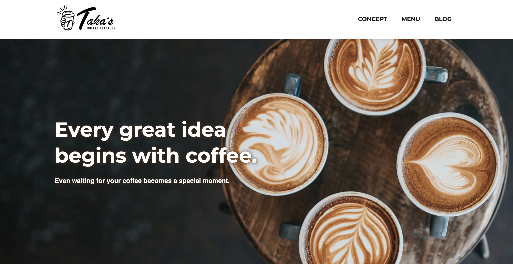
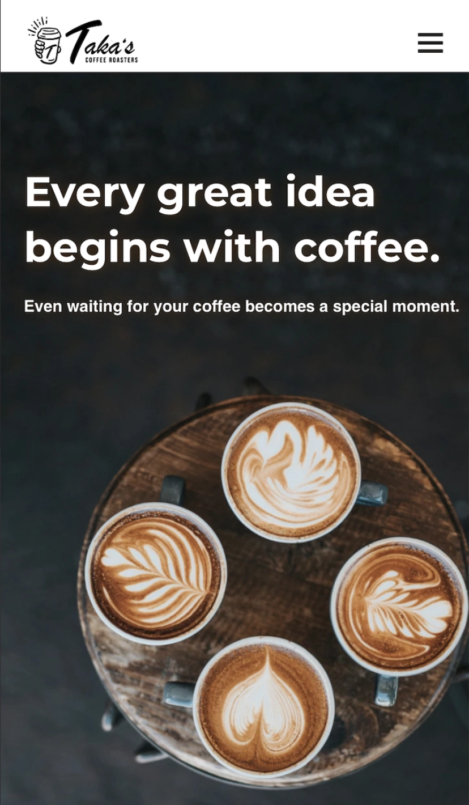

# Taka's Coffee – WordPress Theme

<div align="center">
  
  
  <br><br>
  <a href="https://takascoffee.takanorihidaka.com/" target="_blank">
    
  </a>
  <br><br>
  <p>
    <a href="#overview">Overview</a> •
    <a href="#what-i-learned">What I Learned</a> •
    <a href="#tech-stack">Tech Stack</a> •
    <a href="#license">License</a>
  </p>
</div>
<br>

## Overview

This project involves building a custom WordPress theme for a café-style website.  
The local development environment was set up using Docker, and the site is deployed on AWS Lightsail (Bitnami).

Previously, I built several portfolio projects using Next.js with a headless CMS (microCMS). While this architecture is modern and flexible, it requires managing both the frontend (e.g., Vercel) and the CMS separately. I began to question whether this setup is always appropriate for small-scale projects or corporate websites.

As a result, I turned to WordPress, one of the most widely used CMS platforms.  
With WordPress, the entire system can be managed on a single server, making deployment and maintenance simpler.  
Additionally, as a frontend engineer, I wanted to gain hands-on experience with custom theme development.

This project also serves as a foundation for future work. Since WordPress is widely used and familiar to many users, it can be used as a headless CMS while retaining its traditional admin interface.  
As a next step, I plan to use this WordPress setup as a headless CMS and build a separate frontend using Next.js that consumes the same data.

<br>

## What I Learned

### WordPress Theme Development

In this project, I did not focus on learning PHP itself, but instead limited my implementation to using WordPress functions for retrieving and rendering data.  
Basic constructs such as conditionals and ternary operators are largely similar to JavaScript, despite slight differences in syntax. As a result, rather than learning a new language from scratch, I was able to proceed by understanding how to use WordPress-specific functions.

- Template & Rendering
  - Understanding the template structure
  - Retrieving and displaying data using WordPress functions
  - Handling images and Google Fonts

- Content Modeling
  - Separating data structures using Custom Post Types
  - Managing custom fields with ACF
  - Structuring content with taxonomies

- Routing & Output
  - Understanding permalinks
  - Implementing pagination

- Meta & Internationalization
  - Setting up OGP metadata
  - Basic i18n support (no translation files implemented)
<br>

### Project Setup & Frontend Workflow

For the custom theme setup, I introduced development tools such as Sass, Prettier, Stylelint, and Husky using npm, and managed the project with Git.  

While working on the project, I based my approach on my experience with Next.js, constantly thinking, “How would this be implemented in WordPress?” and structuring the tools and setup accordingly.  

Although the frameworks are different, I found that the overall development workflow-setting up tools, preparing layout components such as headers and footers, and then building the main content-shares many common patterns.  
<br>

### Local Development Environment (Docker)

For this project, I designed the local development environment by working backward from the deployment setup, since the goal was to publish it as a portfolio project.  
As a result, I adopted a structure where only the custom theme directory is managed with Git.  

In the local environment, I ran WordPress using Docker containers and mounted the theme directory, plugins, media files, and wp-config.php as volumes to ensure data persistence.

```
/wp-project/
  ├── docker-compose.yml/
  ├── wp-plugins/
  ├── wp-uploads/
  ├── wp-config.php
  └── takascoffee-theme/ <- Git
         ├── assets/
         ├── src/scss/
         ├── index.php
         ├── functions.php
         │     ...
         └── package.json
```
<br>

### Deployment (AWS Lightsail)

I chose AWS Lightsail because it is relatively easy to use and allows for straightforward cost management. I had also used it in previous portfolio projects.  
Since the primary focus of this project was custom theme development, I intentionally avoided spending too much time on infrastructure.  

To keep the setup simple, I deployed the application using the Bitnami WordPress image on Lightsail, without relying on additional AWS services such as load balancers.

- Enabled SSL using the Bitnami `bncert-tool`
- Applied basic security practices, including disabling XML-RPC, creating a new admin user, limiting login attempts, enabling automatic updates, and setting appropriate permissions for `wp-config.php`
- Verified both deployment methods: uploading a ZIP file via the WordPress admin panel and deploying via GitHub using clone/pull in the themes directory
- Migrated data from the local environment to the production WordPress instance
<br>

### Development Workflow (GitHub & PR)

In my previous portfolio projects, I followed a GitHub-based workflow using feature branches and Pull Requests.  
In this project, I extended that workflow by incorporating code reviews with Copilot.

```
push → PR → review → fix → merge
```

When working alone, it is difficult to see the value of Pull Requests since conflicts rarely occur.  
However, by introducing a review step before merging, I was able to simulate a team development workflow and better understand the purpose of PRs.  

At this stage, I prioritize writing code with a clear understanding rather than relying on AI-driven development.  
However, after completing the project, I conducted a full review using Codex and Copilot (Opus), incorporating feedback from different perspectives to improve overall quality.

<br>

## Tech Stack

<table>
  <tr>
    <th>Frontend</th>
    <td>
      
      
      
    </td>
  </tr>
  <tr>
    <th>Backend</th>
    <td>
      
    </td>
  </tr>
  <tr>
    <th>Code Quality</th>
    <td>
      
      
      
    </td>
  </tr>
  <tr>
    <th>Infrastructure</th>
    <td>
      
      
    </td>
  </tr>
</table>

<br>

## License
This project was created for educational and portfolio use.  
Licensed under the [MIT License](./LICENSE).  

Some assets and design elements are inspired by ["HTML&CSSとWebデザインが1冊できちんと身につく本"](https://gihyo.jp/book/2022/978-4-297-12510-3).

These materials are not covered by the MIT License.  
Please refer to the original publication for usage rights.